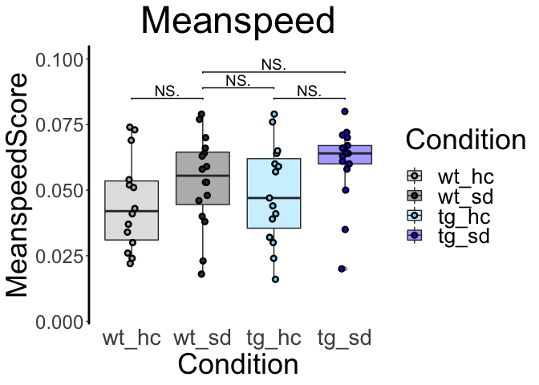
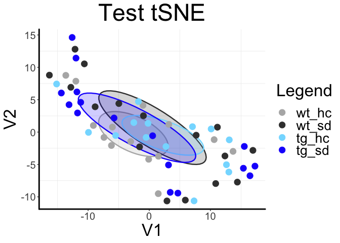

ReadMe for ntbgraphics
================

## Introduction

This package includes functions for importing, transforming and
visualization of NTB datasets:

  - ‘*getexpdata*’ for import of the Animal List (containing animal
    RFIDs, corresponding Genotypes and optionally Environment) and Meta
    Behavior (containing animals and their behavioral measures) as well
    as formal preparation;
  - ‘*ploteachexp*’ for plotting of given experiments as boxplots and
    exporting the result as a PDF file;
  - ‘*loopplotexp*’ for plotting all experiments within a dataset as
    boxplots and exporting the results in one PDF file;
  - ‘*heatmapexp*’ for plotting all experiments as a heatmap and
    producing a datamatrix with z-scored values;
  - ‘*pcatsneexp*’ for PCA and tSNE results and cluster plots.

## Basic Principles of Functions and Dependences

All functions take a **directory** as their input, which specifies the
location of the **two files** “Animal List.xlsx” and “Meta
Behavior.xlsx” (mind correct spelling of these files - functions rely
on specific names\!). It is also important that you mind correct
**formatting** of your excel files. This includes:

  - at least three columns with information about ‘RFID’, ‘Genotype’ and
    ‘Environmental’ \[Condition\] in your Animal List with these exact
    titles;
  - at least three columns with information about ‘Animal’, ‘Meanspeed’
    and ‘SerialLearn’ in your Meta Behavior with these exact titles;
  - correct order of columns:
      - the Animal List does not require a certain order;
      - the Meta Behavior should list ‘Meanspeed’ as the very first and
        ‘SerialLearn’ as the very last of all behavioral experiments
        (only columns inbetween including the former will be considered
        for behavioral analysis) – ‘Animal’ might be at the very
        beginning or end, but not inbetween\!  

Furthermore, each function requires definition of the experimental setup
in terms of 4-arm or 2-arm design, respectively required type of
analysis (you may want to analyze your 4-arm experiment as 2-arm, only
looking at two conditions). The default setup assumes a 4-arm
experiment. Further aspects can be customized depending on the specific
function.

All functions externally work on their own, which means that they may
rely internally on one of the other functions of the package without the
user needing to run them in advance.

## Examples

The following plot shows the general layout you can expect from the
boxplot functions (‘ploteachexp’ and ‘loopplotexp’).  

<!-- -->  
  
 

The following map shows the general layout you can expect from the
‘heatmapexp’ function (please note: random data; therefore most likely
no convincing clustering).  

<!-- -->  
  
 

The following maps show the general layout you can expect from the
‘pcatsneexp’ function (please note: random data; therefore most likely
no convincing clustering).
 

<!-- --><!-- --><!-- -->

## Installation

If you want to install this package, the following lines of code provide
a simple way that does not rely on any dependencies except from you
having installed R and a GUI of your choice, e.g. RStudio. You may copy
all of the lines in the following paragraph or skip certain lines if
redundant.

``` r
## install package devtools to get - amongst others - functions to access ntbgraphics 
## (and every other package on GitHub)
install.packages("devtools")
## load package devtools
library(devtools)
## install ntbgraphics with function 'install_github' from package devtools
install_github("volkmannp/ntbgraphics")
## that is it!

## you are now ready to use ntbgraphics on your computer and may load it using...
library(ntbgraphics)
## for examples on how to use the functions, read on below
```

For your information: You can use the command ‘install.packages’ for the
installation of devtools due to its availability on CRAN (Comprehensive
R Archive Network). Since ntbgraphics is not part of CRAN, its
installation needs another function (‘install\_github’) that in turn is
part of the devtools package.

## Demo

After installing ntbgraphics, you probably want to explore the package
with some random data or might simply be curious how to specifically
deal with the functions provided. Thus, below you may find some lines of
code that address this inquisitiveness.  

The example data used for the following is provided within the package
by being included in the installed files. You may simply copy all lines
and run them at once or copy indivdual lines/functions you have a
particular interest in.  

Note: Each function works independently of what you may have run in
advance as long as ntbgraphics has been loaded. Although the example
shows the ‘getexpdata’ function as its very first, running it is not
necessary for the other functions to work. This holds true for every
single function\!    
Also note that the directory within these lines aims for working on
every computer by accessing the data provided within the package. If you
want to work using your own files and directories, they might rather
look like this: “/Users/user/Documents/experiments/ntb/run1”

``` r
## clear workspace and load libraries (and functions)
rm(list = ls(all.names = TRUE))
library(ntbgraphics)

## (getexpdata) get modified table with data
data.animal.joined <- getexpdata(directory = paste0(system.file("extdata/", package = "ntbgraphics",
                                                                mustWork = T),"/"), analysis = "4arm")

## (ploteachexp) plot a defined experiment
ploteachexp(expname = "Meanspeed",
            directory = paste0(system.file("extdata", package = "ntbgraphics", mustWork = T),"/"),
          # saveplotdir = paste0(system.file("extdata", package = "ntbgraphics", mustWork = T),"/"),
            saveplotdir = FALSE,
            analysis = "4arm",
            orderplots = "tcf4")

## (loopplotexp) plot all experiments
loopplotexp(directory = paste0(system.file("extdata", package = "ntbgraphics", mustWork = T),"/"),
            analysis = "4arm",
            orderplots = "tcf4")

## (heatmapexp) print out heatmap
data.animal.matrix <- heatmapexp(directory = paste0(system.file("extdata", package = "ntbgraphics",
                                                                mustWork = T),"/"),
                                 analysis = "4arm",
                                 title = "Example Data Heatmap")

## (pcatsneexp) plot PCA and tSNE
results <- pcatsneexp(directory = paste0(system.file("extdata/", package = "ntbgraphics", 
                                                     mustWork = T),"/"),
                      analysis = "4arm",
                      perplex =  10,
                      theta = 0.8,
                      pastetitle = "Example PCA",
                      pastetitle2 = "Example tSNE")
### -> access results of pcatsneexp (requires to run pcatsneexp and store results as shown above)
results_pca <- results[[1]]
results_tsne <- results[[2]]
```
